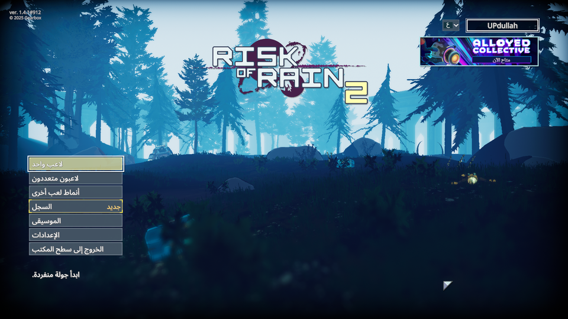
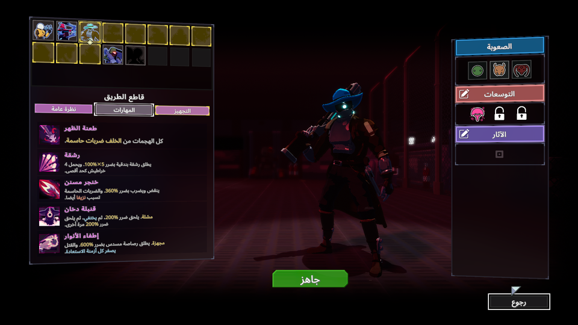
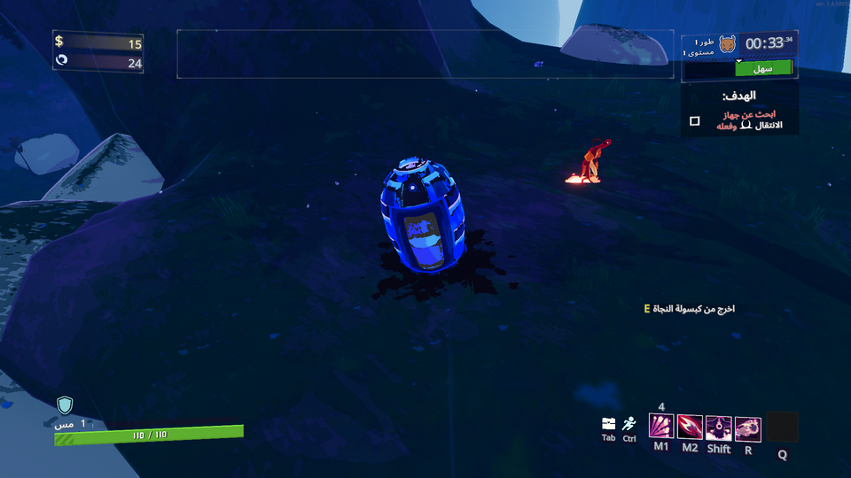
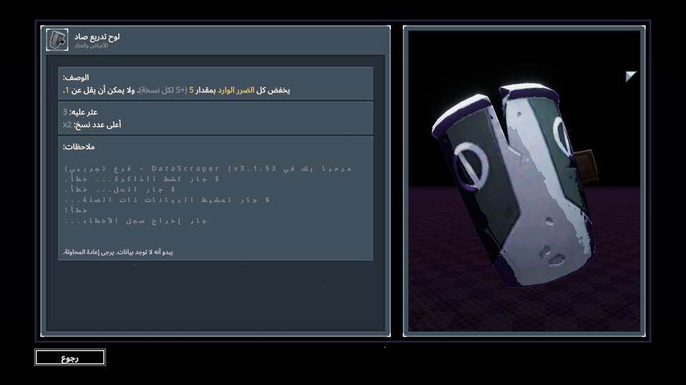

<div dir="rtl">

# ‏Risk of Rain 2‎ بالعربية

تعريب للعبة [‏Risk of Rain 2‎](https://store.steampowered.com/app/632360/) على هيئة إضافة.
لا يُعدَّل أي ملف من ملفات اللعبة: إزالة الإضافة تُعيدها إلى الإنجليزية تمامًا كما كانت.

</div>









<div dir="rtl">

## التنزيل

نزّل أحدث ملف من صفحة **[الإصدارات](../../releases)**، ثم فُكّ ضغطه.

## قبل التثبيت

التعريب إضافة تعمل من خلال **BepInEx**، فلا بد من تثبيته أولًا:

1. نزّل **BepInEx 5.4.21** نسخة **x64** من [صفحة إصداراته](https://github.com/BepInEx/BepInEx/releases).
2. فُكّ ضغطه داخل مجلد اللعبة، بحيث يصير مجلد `BepInEx` بجوار `Risk of Rain 2.exe`.
3. شغّل اللعبة مرة واحدة ثم أغلقها.

ومن يستعمل r2modman أو Thunderstore Mod Manager فـBepInEx موجود مسبقًا داخل مجلد الملف
الشخصي، ويكفي توجيه المثبّت إليه.

## التثبيت على ويندوز

انقر نقرًا مزدوجًا على `install-windows.bat`.

تفتح نافذة صغيرة تعثر على اللعبة وحدها؛ اضغط **تثبيت**. وإن لم تجدها، اضغط **استعراض**
وحدّد المجلد الذي يحتوي على `Risk of Rain 2.exe`.

إن ظهرت رسالة عن الصلاحيات، اضغط على الملف بزر الفأرة الأيمن واختر **تشغيل كمسؤول**.

## التثبيت على لينكس

</div>

```bash
./install.sh
```

<div dir="rtl">

ولتحديد مسار اللعبة بنفسك:

</div>

```bash
./install.sh "/path/to/Risk of Rain 2"
```

<div dir="rtl">

## تشغيل التعريب

شغّل اللعبة ← اضغط قائمة اللغات في أعلى يمين الشاشة ← اختر **العربية**.

اختر اللغة من داخل اللعبة لا من ملف `config.cfg`، فاللعبة تحفظ اللغة في Steam Cloud
وتستعيدها فوق أي تعديل يدوي.

## الإزالة

في ويندوز: شغّل `install-windows.bat` واضغط **إزالة**.

وفي لينكس:

</div>

```bash
./install.sh --uninstall
```

<div dir="rtl">

## ما ينبغي معرفته

- **اللعب الجماعي يعمل كالمعتاد.** الإضافة لا ترفع `RoR2Application.isModded`، وهو العَلَم
  الذي يضيف وسم `mod` إلى الغرفة ويفصل المُطابقة عن اللاعبين العاديّين. فهي تضيف نصًّا وخطًّا
  فقط ولا تمسّ حالة اللعبة، وتبقى الغرف والإنجازات والمحاكمات المنشورية كما هي.
- **ملفات اللعبة لا تُمَس.** كل شيء داخل مجلد واحد اسمه `BepInEx/plugins/RoR2Arabic`، وحذفه
  وحده كافٍ للتراجع عن كل شيء.
- النصوص مكتوبة بلا تشكيل، لأن محرّك النصوص في اللعبة لا يضع الحركات في مواضعها الصحيحة.
- النصوص في القوائم مُحاذاة إلى اليسار لا إلى اليمين، لأن المحاذاة تحدّدها تخطيطات اللعبة
  نفسها لا النصوص.
- المترجَم **4,067** نصًّا من **4,677**. وما بقي بالإنجليزية مقصود: أسماء صنّاع اللعبة (315)،
  ونصوص المحرّك والصيغ (18)، ونصوص تركها المطوّرون فارغة (60). ولا تزال مداخل سجلّ الأغراض
  والعتاد (217) قيد الترجمة.
- النسخة المدعومة من اللعبة: **1.4.1#912**. إن حُدِّثت اللعبة وبدا شيء في غير موضعه، أعد التثبيت.

## وجدت خطأً؟

افتح [مشكلة](../../issues) واذكر النص كما ظهر وأين رأيته في اللعبة، وأرفق صورة إن أمكن.
وإن ظهر سطر قبل السطر الذي يسبقه داخل صندوق ما، فتلك لوحة لم تُقَس بعد؛ اذكر اسم اللوحة.

## الخطوط والتراخيص

الخط المستخدم [Noto Sans](https://github.com/notofonts/latin-greek-cyrillic) — وهو خط اللعبة
نفسه — مدموجًا مع [Noto Sans Arabic](https://github.com/notofonts/arabic)، وكلاهما برخصة
SIL Open Font License 1.1.

شيفرة المشروع برخصة MIT. هذا عمل غير رسمي من المعجبين، ولا صلة له بمطوّري اللعبة.

## للمساهمين

شرح آلية العمل وبنية المشروع في [docs/internals.md](docs/internals.md)، ودليل المصطلحات
وقواعد الصياغة في [docs/glossary.md](docs/glossary.md).

</div>
